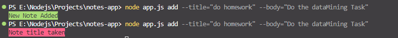

# Notes App

## ADD Note
```
node app.js add --title="do homework" --body="Do the dataMining Task"
```


## Remove Note
```
node app.js remove --title="do homework" --body="Do the dataMining Task"
```


## List Notes
```
node app.js list
```


## Search by Note Using title
```
node app.js remove --title="do homework" --body="Do the dataMining Task"
```


